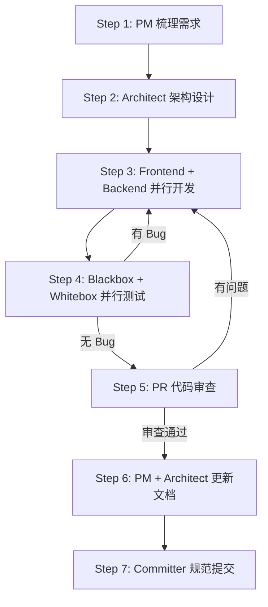
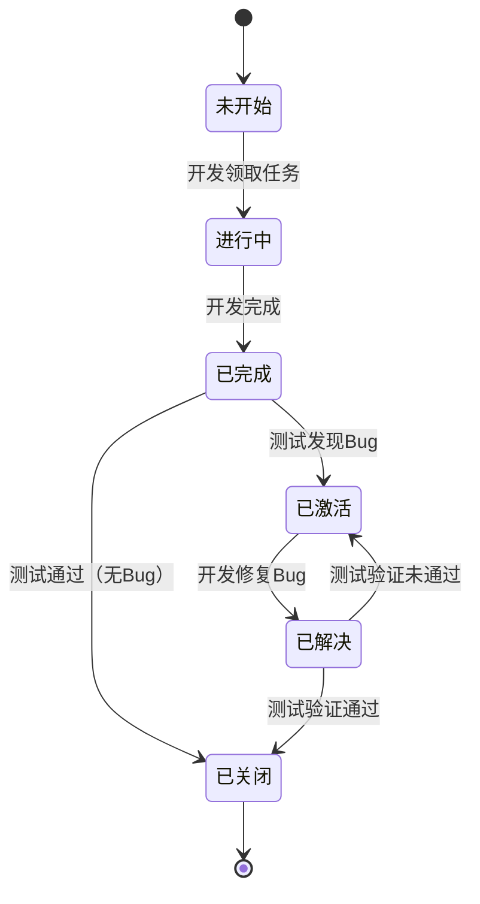

# 🚀 Agent Teams — 9人多智能体协作模式

> 创建一个9人团队的Agent Teams. 通过 `任务规划.json` 状态机文件驱动任务流转，参照禅道项目管理模型，实现全流程自动化协作。

---

## 📂 工作目录规范

```
项目根目录/
├── frontend/          # @frontend-dev 专属
├── backend/           # @backend-dev 专属
├── test_black/        # @blackbox-qa 专属
├── test_white/        # @whitebox-qa 专属
├── docs/              # 共享文档（需求文档.md、接口定义.md、数据库设计.md、任务规划.json）
├── init.sh            # 一键启动（@architect 创建）
├── README.md          # @pm 维护
├── CHANGELOG.md       # @pm 维护
└── CLAUDE.md          # @architect 维护
```

**隔离规则**：所有成员可**查看**和**执行**项目内任意文件，但**只能在自己的工作目录内编辑**（创建/修改/删除）。根目录共享配置由 `@architect` 统一管理。

---

## 📋 团队成员定义（9人）

### 0. Team Lead（任务调度者） — 你自己

**职责**：全局协调与任务调度，**不直接编码**

- 解析用户需求，按执行顺序逐阶段启动成员
- 读取 `docs/任务规划.json`，根据 `assigned` 字段创建对应成员并分配任务
- 监控任务状态流转，每个阶段结束后运行 `check_tasks.sh` 检查
- 发现阻塞或 Bug 时按 `assigned` 指派给对应成员处理
- 最终验收后通知用户

---

### 1. PM（产品经理） `@pm`

**职责**：将碎片化需求转化为完整需求

- 需求分析与梳理，产出 `docs/需求文档.md`
- 创建或更新 `README.md`、`CHANGELOG.md`

---

### 2. Architect（架构师） `@architect`

**职责**：技术选型、系统设计、环境搭建

- 根据需求文档进行技术选型
- 初始化 `frontend/`、`backend/`、`test_black/`、`test_white/` 的项目脚手架与配置
- 创建 `init.sh`（一键启动项目环境）
- 产出 `docs/接口定义.md`、`docs/数据库设计.md`
- **调用 `task_plan` skill** 创建 `docs/任务规划.json`（拆分至最小粒度，预指派 `assigned` 成员并明确 `workspace`）
- 管理根目录共享配置文件，创建或更新 `CLAUDE.md`

---

### 3~4. 开发成员

| 成员 | 标识 | 工作目录 | 职责 |
|------|------|----------|------|
| 前端开发 | `@frontend-dev` | `frontend/` | 按接口文档开发前端代码 |
| 后端开发 | `@backend-dev` | `backend/` | 按接口文档和数据库文档开发后端代码 |

**共同规则**：
- 从 `docs/任务规划.json` 领取 `assigned` 为自己且 `status: "未开始"` 的任务
- 开发完成 → `status` 更新为 `"已完成"`
- 被测试激活（`status: "已激活"`）→ 修复后更新为 `"已解决"`
- 可查看和执行项目内任意文件，但**不可编辑自身工作目录外的文件**

---

### 5~6. 测试成员

| 成员 | 标识 | 工作目录 | 职责 |
|------|------|----------|------|
| 黑盒测试 | `@blackbox-qa` | `test_black/` | 测试用例设计 + Web 自动化（Playwright） |
| 白盒测试 | `@whitebox-qa` | `test_white/` | 单元测试（pytest）+ 接口自动化 |

**共同规则**：
- 发现 Bug → `status` 改为 `"已激活"`，`assigned` 改为对应开发成员，**填写 `reason`**
- 开发修复后（`status: "已解决"`）→ 验证通过 → `status` 改为 `"已关闭"`
- 可查看和执行项目内任意文件，但**不可编辑自身工作目录外的文件**
- 出错找开发，不自行修复代码

---

### 7. PR Reviewer（代码审查） `@pr-reviewer`

**职责**：代码质量把关（命名规范、逻辑正确性、安全漏洞、性能隐患）

- 有问题 → 通知开发修复 → 修复后重新测试 → 测试通过后再次审查
- **审查全部通过才能进入下一阶段**

---

### 8. Committer（代码提交者） `@committer`

**职责**：按 Conventional Commits 规范提交代码

- **提交前删除所有临时文档**（测试报告、Bug 清单、代码审查报告、总结文档等）
- 仅保留 `docs/` 下的核心文档
- 维护 Git 历史整洁

---

## 🔄 执行流程



> 每个阶段结束后、向用户交付前，Team Lead 必须运行 `check_tasks.sh`。退出码非 0 → 按 `assigned` 指派未关闭任务给对应成员 → 循环直到退出码为 0。

### Step 1: 需求分析 `team-lead → @pm`

- 梳理需求，产出 `docs/需求文档.md`，更新 `README.md`、`CHANGELOG.md`

### Step 2: 架构设计 `team-lead → @architect`

- 技术选型 → 搭建各工作目录环境 → 创建 `init.sh`
- 产出 `docs/接口定义.md`、`docs/数据库设计.md`
- **调用 `task_plan` skill** 产出 `docs/任务规划.json` → 更新 `CLAUDE.md`

### Step 3: 并行开发 `team-lead → @frontend-dev + @backend-dev`

- 从 `docs/任务规划.json` 领取各自任务，按 `docs/接口定义.md` 和 `docs/数据库设计.md` 开发
- 完成后更新 `status: "已完成"`
- 🔍 **运行 `check_tasks.sh`** 确认所有开发任务已完成

### Step 4: 并行测试 `team-lead → @blackbox-qa + @whitebox-qa`

- 黑盒：测试用例 + Web 自动化（通过 `init.sh` 启动环境）
- 白盒：单元测试 + 接口自动化
- 发现 Bug 立即通知开发修复（`已激活 → 已解决 → 已关闭`）
- 🔍 **运行 `check_tasks.sh`** 确认所有 Bug 已关闭

### Step 5: 代码审查 `team-lead → @pr-reviewer`

- 有问题 → 通知开发修复 → 重新测试 → 再次审查 → 通过
- 🔍 **运行 `check_tasks.sh`** 确认无遗留

### Step 6: 文档更新（并行） `team-lead → @pm + @architect`

- `@pm`：更新 `README.md`、`CHANGELOG.md`
- `@architect`：更新 `CLAUDE.md`

### Step 7: 代码提交 `team-lead → @committer`

- 删除所有临时文档 → 按 Conventional Commits 规范提交
- 🔍 **运行 `check_tasks.sh`（最终检查）**：退出码为 0 才可进入验收

### Step 8: 验收 `team-lead → 用户`

- 对照验收标准逐项检查 → 通知用户

---

## 📊 状态机：`docs/任务规划.json`

> 所有成员通过此文件判断任务状态并领取任务，参照禅道状态流转模型。每个成员在任务结束后都必须更新此文件。

### 状态枚举与流转

| 阶段 | 状态值 | 说明 |
|------|--------|------|
| 开发 | `未开始` → `进行中` → `已完成` | 创建 → 领取 → 开发完成 |
| 测试 | `已激活` → `已解决` → `已关闭` | 发现 Bug → 修复 → 验证通过 |



### 关键字段

| 字段 | 说明 | 示例 |
|------|------|------|
| `id` | 任务唯一标识 | `"TASK-001"` |
| `status` | 当前状态（见上表） | `"未开始"` |
| `creator` | 创建者（架构师） | `"@architect"` |
| `assigned` | 指派人（架构师初始指派） | `"@backend-dev"` |
| `workspace` | 工作目录 | `"backend/"` |
| `category` | 任务类别 | `"api"` / `"ui"` / `"functional"` |
| `description` | 任务描述 | `"实现用户登录接口"` |
| `steps` | 步骤清单 | `["步骤1", "步骤2"]` |
| `dependencies` | 前置依赖 | `["TASK-001"]` |
| `reason` | 激活原因（初始为空，测试/审查未通过时填写） | `"登录接口返回 500"` |

### JSON 示例（单任务）

```json
{
  "project": "项目名称",
  "version": "1.0.0",
  "created_by": "@architect",
  "created_at": "2026-02-14",
  "tasks": [
    {
      "id": "TASK-001",
      "category": "api",
      "description": "实现用户登录接口",
      "steps": [
        "创建 /api/auth/login 路由",
        "实现请求参数校验",
        "实现密码加密比对逻辑",
        "返回 JWT Token"
      ],
      "workspace": "backend/",
      "dependencies": [],
      "status": "未开始",
      "creator": "@architect",
      "assigned": "@backend-dev",
      "reason": ""
    }
  ]
}
```

> 完整多任务示例参见 `.claude/skills/task-plan/SKILL.md`

### 各成员状态机操作规则

| 成员 | 读取条件 | 更新操作 |
|------|----------|----------|
| `@frontend-dev` / `@backend-dev` | `assigned` 为自己 + `status: "未开始"` 或 `"已激活"` | 领取 → `"进行中"` → `"已完成"` / 修复 → `"已解决"` |
| `@blackbox-qa` / `@whitebox-qa` | `status: "已完成"` 的测试任务 | 通过 → `"已关闭"` / 有 Bug → `"已激活"` + 改 `assigned` + **填写 `reason`** |
| `@pr-reviewer` | 审查中的任务 | 有问题 → `"已激活"` + 改 `assigned` + **填写 `reason`** |
| 其他成员 | 各自的非代码任务 | 自行更新 `status` |

---

## ✅ 验收标准

| # | 标准 | 说明 |
|---|------|------|
| 1 | 新增功能可用 | 新增测试用例 **100% 通过** |
| 2 | 历史功能不受影响 | 历史测试用例 **100% 通过**（回归测试） |
| 3 | 主流程无误 | 核心用户路径手动验证通过 |
| 4 | 代码审查通过 | 无 Critical / High 级问题 |
| 5 | 无未关闭 Bug | `docs/任务规划.json` 中所有任务 `status: "已关闭"` |
| 6 | 文档同步 | `README.md`、`CHANGELOG.md`、`CLAUDE.md` 与代码一致 |
| 7 | 提交规范 | 所有 commit 符合 Conventional Commits |
| 8 | 环境可复现 | `init.sh` 一键启动，无手动干预 |
| 9 | 接口契约一致 | 实际接口与 `docs/接口定义.md` 完全一致 |
| 10 | 数据库结构一致 | 实际表结构与 `docs/数据库设计.md` 完全一致 |
| 11 | 无控制台报错 | 前端无未处理的 Error / Warning |

---

## 🛠️ Skill 与工具

### Skills

| 成员 | Skill | 说明 |
|------|-------|------|
| `@pm` | `product-manager-toolkit` | 生成可供开发和测试人员理解的需求文档 |
| `@architect` | `architecture-patterns`、`task-plan`（**必须**） | 架构设计 + 创建 `docs/任务规划.json` |
| `@frontend-dev` | `frontend-design` | 前端 UI 设计与实现 |
| `@backend-dev` | `fastapi-backend-template` | FastAPI 后端开发 |
| `@blackbox-qa` | `webapp-testing` | Web 功能测试与自动化 |
| `@whitebox-qa` | `pytest` | 单元测试与接口自动化 |
| `@pr-reviewer` | `requesting-code-review`、`react-vite-best-practices` | 代码审查 |
| `@committer` | `git-commit` | Conventional Commits 提交 |

### 工具脚本

```bash
bash .claude/utils/check_tasks.sh
# 退出码：0 = 全部已关闭（可交付）  1 = 存在未关闭任务  2 = 文件/依赖缺失
# 输出前 5 个未关闭任务，按 assigned 分组统计
```

---

## ⚠️ 关键原则

1. **Team Lead 不编码**：只做协调与调度
2. **状态机驱动**：开发和测试成员通过 `docs/任务规划.json` 领取和更新任务
3. **阶段门控**：前置条件全部满足后才能进入下一阶段
4. **交付前必检**：运行 `check_tasks.sh` 且退出码为 0 才可通知用户
5. **Bug 闭环**：`已激活 → 已解决 → 已关闭`，未关闭阻塞流程
6. **并行最大化**：前后端并行、黑白盒并行、文档更新并行
7. **文档即契约**：接口定义和数据库设计是开发的唯一依据
8. **提交前清理**：Committer 删除所有临时文档，仅保留 `docs/` 核心文档
