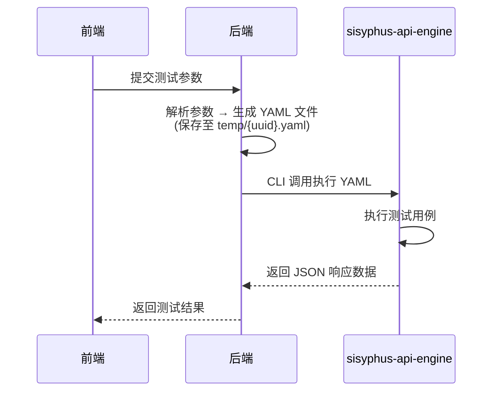

<![CDATA[# Sisyphus-X-Pro 自动化测试管理平台 — 产品需求文档 (PRD)

| 字段       | 值                                  |
| ---------- | ----------------------------------- |
| 文档版本   | v1.0.0                              |
| 状态       | 📝 草案                             |
| 创建日期   | 2026-02-13                          |
| 最后更新   | 2026-02-13                          |
| 作者       | Poco                                |
| 审核人     | —                                   |
| 项目仓库   | `koco-co/Sisyphus-X-Pro`            |

---

## 目录

- [1. 项目概述](#1-项目概述)
- [2. 技术架构](#2-技术架构)
- [3. 全局规范](#3-全局规范)
- [4. 功能模块需求](#4-功能模块需求)
  - [4.1 登录与注册](#41-登录与注册)
  - [4.2 首页仪表盘](#42-首页仪表盘)
  - [4.3 接口自动化](#43-接口自动化)
    - [4.3.1 项目管理](#431-项目管理)
    - [4.3.2 关键字配置](#432-关键字配置)
    - [4.3.3 接口定义](#433-接口定义)
    - [4.3.4 场景编排](#434-场景编排)
    - [4.3.5 测试计划](#435-测试计划)
    - [4.3.6 测试报告](#436-测试报告)
  - [4.4 系统设置](#44-系统设置)
  - [4.5 后续规划模块](#45-后续规划模块)
- [5. 核心执行器：sisyphus-api-engine](#5-核心执行器sisyphus-api-engine)
- [6. 非功能性需求](#6-非功能性需求)
- [7. 术语表](#7-术语表)
- [8. 版本历史](#8-版本历史)

---

## 1. 项目概述

### 1.1 产品愿景

Sisyphus-X-Pro 是一个面向 QA 团队和开发者的 **一站式自动化测试管理平台**，以接口自动化为核心能力，后续扩展至 WEB / APP 自动化。平台通过统一的项目管理、可视化场景编排、数据驱动测试、多维度测试报告等能力，帮助团队高效管理和执行自动化测试用例。

### 1.2 核心目标

| # | 目标                             | 衡量标准                                 |
|---|----------------------------------|------------------------------------------|
| 1 | 提供完整的接口自动化用例管理能力 | 覆盖项目管理 → 接口定义 → 场景编排 → 测试计划 → 测试报告全链路 |
| 2 | YAML 驱动的核心执行引擎          | 1 个 YAML = 1 个完整测试场景；支持数据驱动 |
| 3 | 多维度测试报告                   | 支持平台自定义报告 + Allure 报告双模式    |
| 4 | 可扩展架构                       | 关键字可自定义扩展；后续可平滑接入 WEB/APP 自动化 |

### 1.3 目标用户

- **QA 工程师**：日常创建、调试、执行测试用例
- **测试负责人**：编排测试计划、查看测试报告、管控质量
- **开发工程师**：快速进行接口联调和回归验证

---

## 2. 技术架构

```
┌──────────────────────────────────────────────────────┐
│                      前端 (Frontend)                  │
│  Vite · React · TypeScript · TailwindCSS · shadcn/ui │
└────────────────────────┬─────────────────────────────┘
                         │ HTTP / WebSocket
┌────────────────────────▼─────────────────────────────┐
│                      后端 (Backend)                   │
│  Python 3.12 · FastAPI · SQLModel · uv · ruff/pyright│
│  ┌──────────────────────────────────────────┐        │
│  │  sisyphus-api-engine (核心执行器)          │        │
│  └──────────────────────────────────────────┘        │
└────────────┬────────────┬────────────┬───────────────┘
             │            │            │
     ┌───────▼──┐  ┌──────▼──┐  ┌─────▼───┐
     │PostgreSQL│  │  MinIO   │  │  Redis  │
     │ (数据库) │  │ (对象存储)│  │ (缓存)  │
     └──────────┘  └─────────┘  └─────────┘
              Docker Compose 统一编排
```

| 层级       | 技术栈                                                                |
| ---------- | --------------------------------------------------------------------- |
| **前端**   | Vite + React + TypeScript + TailwindCSS + shadcn/ui                   |
| **后端**   | Python 3.12 + FastAPI + SQLModel + uv + ruff + pyright                |
| **中间件** | PostgreSQL + MinIO + Redis（Docker Compose 编排）                     |
| **执行器** | sisyphus-api-engine（Python CLI，YAML 驱动，Allure/Rich/JSON 多格式） |
| **白盒测试** | pytest + requests + uv + Python 3.12                               |
| **黑盒测试** | Playwright（待定）                                                 |

---

## 3. 全局规范

### 3.1 开发规范

| # | 规范项                         | 说明                                                                   |
|---|--------------------------------|------------------------------------------------------------------------|
| 1 | 代码风格                       | 遵循 Google 开发范式，代码注释使用 **中文**                             |
| 2 | 项目结构                       | 前端、后端、测试、核心执行器的配置和文档统一在根目录维护                 |
| 3 | 文档管理                       | `README.md` 和 `CHANGELOG.md` 使用同一个文档                            |

### 3.2 UI / 交互规范

| # | 规范项                  | 说明                                                                                     |
|---|-------------------------|------------------------------------------------------------------------------------------|
| 1 | Toast 提示              | 全局统一样式，右上角显示，带进度条倒计时；文案仅显示操作结果（如"编辑成功"）               |
| 2 | 分页组件                | 所有列表页均支持分页，分页组件样式全局统一                                                 |
| 3 | 枚举字段筛选            | 列表中存在枚举值的字段，均需提供筛选按钮，支持「重置」和「确定」操作                        |
| 4 | 标签页切换              | 接口自动化各模块均支持标签页切换，支持关闭全部 / 当前 / 其它标签页                          |
| 5 | 暂无数据样式            | 全局统一的"暂无数据"占位样式                                                               |
| 6 | 弹窗 / 下拉框 / 查询框  | 组件样式全局统一                                                                          |
| 7 | 启用 / 禁用状态          | 统一使用开关（Switch）组件，样式全局一致                                                   |
| 8 | 文案规范                | 全局文案格式统一，无歧义，命名准确                                                        |

---

## 4. 功能模块需求

### 4.1 登录与注册

**模块说明**：为平台提供用户身份认证能力。

#### 4.1.1 页面布局

| 区域   | 内容                                                                                                                          |
| ------ | ----------------------------------------------------------------------------------------------------------------------------- |
| 左半屏 | SisyphusX 品牌标识 — 字体飘逸风格；下方中文打字机动效（结合 Sisyphus 寓意，传达"打破宿命循环"的理念）；整体居中，动态背景     |
| 右半屏 | 登录 / 注册表单                                                                                                               |

#### 4.1.2 认证方式

| 方式             | 说明                                          |
| ---------------- | --------------------------------------------- |
| 邮箱注册 / 登录  | 标准邮箱 + 密码表单                            |
| GitHub SSO       | OAuth 2.0 单点登录                             |
| Google SSO       | OAuth 2.0 单点登录                             |

#### 4.1.3 开发模式特性

- 开发模式下（`DEV` 环境），默认 **关闭 Token 验证**，方便本地开发调试。

---

### 4.2 首页仪表盘

**模块说明**：以数据可视化方式呈现平台核心指标。

- 展示关键统计数据（项目数、用例数、执行通过率、最近执行趋势等）。
- 图表类型：趋势折线图、通过率环形图、模块分布柱状图等（具体由产品设计确定）。

---

### 4.3 接口自动化

> 接口自动化为平台核心功能模块，包含 **项目管理 → 关键字配置 → 接口定义 → 场景编排 → 测试计划 → 测试报告** 六大子模块。

---

#### 4.3.1 项目管理

**模块说明**：管理接口自动化项目及其数据库连接配置。

##### A. 项目列表

| 列表字段     | 说明                                             |
| ------------ | ------------------------------------------------ |
| 项目名称     | 项目标识名称                                     |
| 项目描述     | 简要描述项目用途                                 |
| 创建人       | 项目创建者                                       |
| 创建时间     | 项目创建时间戳                                   |
| 更新时间     | 最后修改时间戳                                   |
| 操作列       | 编辑（图标）· 数据库配置（图标）· 删除（图标）   |

**交互要求**：

- 支持分页列表
- 删除操作需 **二次确认弹窗**
- 操作成功后展示全局 Toast 提示

##### B. 数据库配置（下钻页面）

**入口**：点击项目列表中的「数据库配置」图标进入。

**列表字段**：

| 字段       | 说明                                                                     |
| ---------- | ------------------------------------------------------------------------ |
| 连接名称   | 用户自定义的连接标识                                                     |
| 引用变量   | 在 YAML / 场景中通过 `{{变量名}}` 引用此连接的标识                        |
| 配置信息   | 组装后的连接信息摘要                                                     |
| 连接状态   | 实时状态（默认每 10 分钟自动测试连接一次）                                |
| 启用状态   | Switch 开关，默认启用                                                    |
| 操作列     | 编辑 · 删除                                                             |

**新增 / 编辑配置（弹窗）**：

| 表单字段   | 类型         | 必填 | 说明                       |
| ---------- | ------------ | ---- | -------------------------- |
| 连接名称   | 文本输入     | ✅   |                            |
| 引用变量   | 文本输入     | ✅   | 需唯一                     |
| 数据库类型 | 下拉选择     | ✅   | 目前适配：MySQL、PostgreSQL |
| 主机       | 文本输入     | ✅   |                            |
| 端口       | 数字输入     | ✅   |                            |
| 初始数据库 | 文本输入     | ✅   |                            |
| 用户名     | 文本输入     | ✅   |                            |
| 密码       | 密码输入     | ✅   |                            |

**业务规则**：

1. 必须先 **测试连接成功** 后才能保存
2. 保存时自动组装配置信息
3. 新增配置默认 **启用**
4. 数据库配置表通过 `project_id` 与项目表关联

**数据模型**：

```
Project (项目表)
├── id (PK)
├── name
├── description
├── creator
├── created_at
└── updated_at

DatabaseConfig (数据库配置表)
├── id (PK)
├── project_id (FK → Project.id)
├── connection_name
├── ref_variable
├── db_type (MySQL | PostgreSQL)
├── host
├── port
├── database
├── username
├── password (加密存储)
├── connection_status
├── is_enabled
├── created_at
└── updated_at
```

---

#### 4.3.2 关键字配置

**模块说明**：管理可扩展的关键字函数，支持在场景编排中通过下拉框引用。

##### A. 关键字列表

| 列表字段   | 说明                                 |
| ---------- | ------------------------------------ |
| 关键字类型 | 分类标识（如 请求、断言、提取等）     |
| 名称       | 关键字显示名称                       |
| 方法名     | 关键字函数的方法名                   |
| 启用状态   | Switch 开关；禁用后不在下拉框中显示   |
| 操作列     | 编辑 · 删除                         |

##### B. 新增 / 编辑关键字（页面 / 弹窗）

| 表单字段           | 类型          | 必填 | 说明                               |
| ------------------ | ------------- | ---- | ---------------------------------- |
| 关键字类型         | 下拉选择      | ✅   |                                    |
| 名称               | 文本输入      | ✅   |                                    |
| 方法名             | 文本输入      | ✅   |                                    |
| 代码块             | Monaco Editor | ✅   | 关键字函数实现代码                  |
| 入参释义（参数名） | 动态表格      | ❌   | 参数名 + 描述，可多行添加           |

- 保存后默认 **启用**

##### C. 内置关键字（不可编辑 / 删除，仅供参考）

| 内置关键字   | 描述                                                                                    |
| ------------ | --------------------------------------------------------------------------------------- |
| **发送请求** | 支持 requests 库所有请求方式（GET、POST、PUT、DELETE 等）                                 |
| **断言类型** | 断言对象：JSON、Header、Cookie、环境变量、HTTP Code、耗时等                               |
| **提取变量** | 提取对象：JSON、Header、Cookie；支持 JSONPath 提取                                       |
| **数据库操作** | 选择项目下已配置的数据源 → 输入 SQL → 支持数据库断言 / 提取变量                          |
| **自定义操作** | 占位符，供后续扩展                                                                     |

**业务规则**：

- 内置关键字的代码需在前端页面中 **回显**，作为用户自定义关键字的参考范例。

---

#### 4.3.3 接口定义

**模块说明**：针对单个接口进行定义与快速调试，按项目维度组织。

##### A. 左侧目录树

- 支持 **新建目录** 和 **新建接口**，接口可放入指定目录
- 目录与接口均支持 **拖拽排序**

##### B. 接口详情

**接口创建方式**：

| 方式          | 说明                        |
| ------------- | --------------------------- |
| 手动填写      | 逐项填写接口信息             |
| cURL 导入     | 粘贴 cURL 命令自动解析       |
| Swagger 导入  | 上传 / 输入 Swagger 文档导入 |

**文件参数处理**：

- 接口调试中的 `file` 类型参数，通过上传至 MinIO 管理
- MinIO 根据不同项目使用 **不同的桶（Bucket）** 进行隔离

##### C. 环境管理

**入口**：接口详情页右上角

| 组件              | 说明                                           |
| ----------------- | ---------------------------------------------- |
| 环境切换下拉框    | 显示当前环境名称，支持快速切换                  |
| 环境管理按钮      | 点击打开环境管理弹窗                            |

**环境管理弹窗**：

| 变量类型     | 作用域           | 设置方式                                   |
| ------------ | ---------------- | ------------------------------------------ |
| **全局变量** | 所有环境通用     | 手动设置 / 通过接口提取变量设置             |
| **环境变量** | 仅当前环境生效   | 手动设置 / 通过接口提取变量设置             |

**新建环境表单**：

| 字段       | 必填 | 说明                                 |
| ---------- | ---- | ------------------------------------ |
| 环境名称   | ✅   |                                      |
| 前置 URL   | ✅   | 如 `https://api-staging.example.com` |
| 环境变量   | ❌   | 变量名 + 变量值 + 变量描述            |

**变量引用**：在参数中通过 `{{变量名}}` 引用全局变量和环境变量。

---

#### 4.3.4 场景编排

**模块说明**：对多个接口进行编排，形成完整的测试场景。一个场景等价于一个 YAML 文件。

##### A. 场景列表

| 列表字段     | 说明               |
| ------------ | ------------------ |
| 所属项目     | 关联的项目名称     |
| 场景名称     | 测试场景标识       |
| 场景描述     | 场景用途说明       |
| 操作列       | 编辑 · 删除       |

**查询条件**：场景名称、所属项目

**支持操作**：增删改查、分页

##### B. 新增 / 编辑场景

包含两部分：**基础信息** 和 **场景信息**。

**① 基础信息**

| 字段     | 必填 | 说明                                   |
| -------- | ---- | -------------------------------------- |
| 所属项目 | ✅   | 下拉选择已有项目                        |
| 名称     | ✅   | 场景名称                               |
| 描述     | ❌   |                                        |
| 优先级   | ✅   | P0 / P1 / P2 / P3（默认 P2）           |
| 标签     | ❌   | 支持多标签                             |

**② 场景信息**

场景信息包含以下 Tab：

| Tab          | 说明                                                                                                     |
| ------------ | -------------------------------------------------------------------------------------------------------- |
| **测试步骤** | 可增删改的步骤列表，支持 **拖拽排序**                                                                     |
| **变量定义** | 当前场景的局部变量                                                                                       |
| **前置 SQL** | Monaco 编辑器；场景执行前运行的 SQL（如建表）；支持 `{{变量名}}` 引用和动态拼接（如 `source_table_{{random(12)}}`） |
| **后置 SQL** | Monaco 编辑器；场景执行后运行的 SQL（如清理表）；规则同上                                                  |

**环境管理入口**：场景编辑页面提供「环境管理」按钮，可快速查看全局变量、环境变量、全局参数。

**测试步骤详情**：

| 步骤字段     | 说明                                                                                                   |
| ------------ | ------------------------------------------------------------------------------------------------------ |
| 步骤描述     | 文本输入                                                                                               |
| 关键字操作   | 级联下拉框（逐级筛选关键字函数）                                                                        |
| 关键字参数   | 根据选择的关键字 **动态加载** 对应的参数表单                                                             |
| 操作列       | 编辑 · 删除                                                                                           |

**关键字参数动态加载规则**：

| 关键字选择              | 动态表单说明                                                                                     |
| ----------------------- | ------------------------------------------------------------------------------------------------ |
| 发送请求 → HTTP 请求    | 下拉选择当前项目中在「接口定义」中已保存的接口（支持目录→接口层级筛选，支持名称搜索）              |
| 断言类型 → JSON         | 填写 JSONPath 表达式、判断符号、预期结果                                                          |
| 提取变量 → JSON         | 填写变量名称、变量类型（全局 / 环境）、JSONPath 表达式                                            |
| 数据库操作              | 选择数据源 → 输入 SQL → 断言 / 提取变量                                                          |
| 其它关键字              | 根据关键字入参定义动态生成                                                                        |

##### C. 右侧边栏

| 组件           | 说明                                                                                                     |
| -------------- | -------------------------------------------------------------------------------------------------------- |
| **运行环境**   | 下拉选择环境；旁边按钮可打开环境管理弹窗                                                                  |
| **测试数据集** | 默认"不使用测试数据"；可选择已创建的数据集；旁边按钮点击后抽屉展开新建数据集页面                            |

**数据集管理（抽屉页面）**：

| 功能         | 说明                                                               |
| ------------ | ------------------------------------------------------------------ |
| 新增数据集   | 输入数据集名称 → 手动输入测试数据 **或** 导入 CSV                    |
| 导出 CSV     | 无数据时导出为空模板                                                |
| 数据引用     | 数据集中表头作为变量名，通过 `{{变量名}}` 在接口参数中引用           |

##### D. 调试功能

| 行为                       | 说明                                                                                       |
| -------------------------- | ------------------------------------------------------------------------------------------ |
| 点击「调试」按钮           | 立即调用 sisyphus-api-engine 执行                                                           |
| 数据驱动并行执行           | N 行测试数据 = N 个 YAML 文件，**并行执行**                                                  |
| 调试结果                   | 执行结束后自动跳转 Allure 报告页面                                                          |
| 结果存储                   | 调试结果 **不持久化**，不记录到测试报告；下次调试自动清除上次结果                              |
| 结果隔离                   | Allure 结果存放于 `temp/{登录账号}/report` 目录，避免多用户数据互相覆盖                       |

##### E. 操作按钮

- **保存**：持久化当前场景
- **调试**：立即执行并跳转报告
- **关闭**：关闭当前编辑页面

**数据模型**：

```
Scenario (场景表)
├── id (PK)
├── project_id (FK → Project.id)
├── name
├── description
├── priority (P0 | P1 | P2 | P3)
├── tags (JSON Array)
├── variables (JSON)
├── pre_sql (TEXT)
├── post_sql (TEXT)
├── created_at
└── updated_at

ScenarioStep (步骤表)
├── id (PK)
├── scenario_id (FK → Scenario.id)
├── sort_order
├── description
├── keyword_type
├── keyword_action
├── keyword_params (JSON)
├── created_at
└── updated_at
```

---

#### 4.3.5 测试计划

**模块说明**：将多个测试场景编排为完整的测试计划，支持执行与结果追踪。

##### A. 计划列表

| 列表字段     | 说明                                       |
| ------------ | ------------------------------------------ |
| 所属项目     | 关联项目名称                               |
| 测试计划名称 | 计划标识                                   |
| 操作列       | 编辑 · 执行 · 复制 · 查看图表 · 删除       |

**查询条件**：计划名称、所属项目

**支持操作**：增删改查、分页

##### B. 新增 / 编辑计划

**① 基础信息**

| 字段         | 必填 | 说明           |
| ------------ | ---- | -------------- |
| 计划名称     | ✅   |                |
| 所属项目     | ✅   |                |
| 描述         | ❌   |                |

**② 测试计划配置**

| 配置项          | 说明                                                                                                                 |
| --------------- | -------------------------------------------------------------------------------------------------------------------- |
| 测试场景        | 从场景编排模块中选择场景并编排执行顺序                                                                                |
| Jenkins 环境    | 可选的 Jenkins 集成配置                                                                                               |
| Webhook 配置    | 可选的 Webhook 回调通知                                                                                               |

**添加测试场景（右侧抽屉）**：

| 抽屉内字段   | 说明                                                               |
| ------------ | ------------------------------------------------------------------ |
| 场景名称     | 显示场景编排中的所有用例                                            |
| 场景描述     | 场景说明                                                           |
| 优先级       | P0 ~ P3（默认 P2）                                                 |
| 标签         | 场景标签                                                           |
| 操作         | 添加按钮                                                           |

- 支持 **项目筛选**（默认为当前计划所属项目）和 **场景名称搜索**
- 支持 **分页列表**

**已添加场景列表**：

| 字段       | 说明                                 |
| ---------- | ------------------------------------ |
| 场景名称   | 已添加的场景                         |
| 变量依赖   | 该场景依赖的变量信息                  |
| 引用数据集 | 关联的测试数据集                      |
| 操作列     | 编辑 · 删除                         |

- 支持 **拖拽排序** 调整执行顺序

##### C. 执行计划

**入口**：点击计划列表中的「执行」按钮 → 下钻至「执行计划 - {计划名称}」页面。

**执行列表**：

| 字段       | 说明                                         |
| ---------- | -------------------------------------------- |
| 场景名称   | 可点击跳转至对应场景编排页面                  |
| 优先级     | P0 ~ P3                                      |
| 标签       | 场景标签                                     |
| 运行环境   | 当前执行环境                                 |
| 运行结果   | 通过 / 失败 / 跳过                           |
| 创建时间   | 执行创建时间                                 |
| 创建人     | 执行发起人                                   |

**交互要求**：

1. 支持分页、查询
2. 鼠标悬浮「运行结果」→ 显示 Tooltip：最近运行时间、通过指标（通过数 / 通过率）、性能指标（耗时）
3. 支持全选 / 批量选择场景 → 右上角「批量运行」按钮

##### D. 运行报告页面（下钻）

**页面结构**：

| 区域           | 内容                                                                                                       |
| -------------- | ---------------------------------------------------------------------------------------------------------- |
| **面包屑导航** | 左侧：`{测试计划名称}`；右侧：「终止」「暂停」按钮                                                          |
| **统计区域**   | 左侧：动态运行状态组件 + 场景通过 / 失败数 + 接口用例通过 / 失败数；右侧：性能指标                            |
| **详情列表**   | 测试场景列表（运行状态、场景名称、运行进度条）                                                               |

**详情列表交互**：

- 默认 **折叠**
- 展开 → 显示场景下的接口请求列表（可再次折叠 / 展开）
- 点击接口请求 → 展开查看请求参数（请求方式、URL 等）
- 点击接口请求名称 → 跳转至场景编排中的对应场景

**运行结束后**：

- 支持「再次运行」
- 支持「导出报告」
- 「Allure 报告」按钮可跳转至 Allure 报告页面
- 报告记录 **持久化** 至测试报告模块

> [!IMPORTANT]
> **执行规则**：测试场景按 **顺序执行**；同一场景内的数据驱动为 **并行执行**（1 行数据 = 1 个 YAML 文件）。后端需确保此并发逻辑的正确性。

---

#### 4.3.6 测试报告

**模块说明**：持久化展示测试计划的执行结果报告。

##### A. 报告列表

| 列表字段     | 说明                                                       |
| ------------ | ---------------------------------------------------------- |
| 报告信息     | 场景名称、运行环境、运行时长、运行人                        |
| 运行状态     | 已完成 · 运行中 · 已终止 · 已暂停 · 失败                    |
| 运行时间     | 执行时间戳                                                 |
| 测试结果     | 图形化展示（如环形图 / 进度条）                             |
| 操作列       | 导出 · 删除                                                |

##### B. 业务规则

1. 每次运行测试计划后自动生成测试报告
2. 默认显示 **平台自定义报告模板**
3. 已结束的测试计划，支持「Allure Report」按钮跳转
4. **Allure 报告默认保留 30 天**
5. 点击场景名称 → 下钻至历史报告页面，支持：再次运行、导出报告、Allure 报告、删除、查询操作
6. 历史报告页面的运行页面与测试计划中的报告页面 **样式一致**

---

### 4.4 系统设置

#### 4.4.1 全局参数

**模块说明**：管理封装的工具类函数，供场景编排中通过 `{{参数名()}}` 引用。

##### A. 参数列表

| 字段           | 说明                                                       |
| -------------- | ---------------------------------------------------------- |
| 参数类名       | 作为分类目录，支持折叠 / 展开                               |
| 参数方法名     | 带复制按钮；点击方法名进入详情页                            |
| 功能描述       | 方法用途说明                                               |
| 入参类型释义   | 参数类型与说明                                             |
| 出参类型释义   | 返回值类型与说明                                           |
| 操作列         | 编辑 · 删除                                                |

##### B. 新增全局参数

1. **Monaco 编辑器** 编写工具函数
2. 提供 `?` 图标，提示用户使用 **规范的 Google Docstring** 编写文档
3. 保存时弹窗 → 自动解析：类名、方法名、功能描述、入参、出参
4. 缺少文档的字段用 `-` 占位
5. 确定后保存，自动按 **类名** 归入对应目录

##### C. 内置全局参数

- 平台初始内置部分工具函数（如 UUID 生成工具等）

---

### 4.5 后续规划模块

> 以下模块在 V1.0 版本中不做实现，仅做占位记录，后续迭代开发。

| 模块           | 子模块                                                                               |
| -------------- | ------------------------------------------------------------------------------------ |
| **WEB 自动化** | 项目管理 · 浏览器集群管理 · 关键字配置 · 项目页面管理 · 页面元素管理 · WEB 用例信息 · WEB 测试计划 |
| **APP 自动化** | 待规划                                                                               |
| **消息通知管理** | 待规划                                                                             |

---

## 5. 核心执行器：sisyphus-api-engine

### 5.1 概述

sisyphus-api-engine 是平台的 **核心执行引擎**，以 CLI 方式运行，接收 YAML 文件作为输入，输出多种格式的测试结果。

### 5.2 核心原则

| 原则                   | 说明                                                         |
| ---------------------- | ------------------------------------------------------------ |
| 1 YAML = 1 场景       | 一个 YAML 文件代表一个完整的测试场景用例                       |
| YAML 规范驱动         | 需提前定义 YAML 输入参数与 JSON 输出参数的规范文档              |
| 多格式输出             | Rich 文本报告（默认）· JSON 响应 · Allure 报告 · HTML 报告    |

### 5.3 数据驱动

| 方式          | 说明                                                           |
| ------------- | -------------------------------------------------------------- |
| CSV 文件      | 在 YAML 中引入 CSV 文件路径                                     |
| YAML `ddts` 字段 | 在 YAML 文件中直接定义测试数据                                |
| 平台数据集    | 通过平台创建并关联                                              |

> 底层实现均通过 pytest 的 `@pytest.mark.parametrize` 装饰器实现。

### 5.4 平台集成流程



### 5.5 变量与参数处理

- 所有变量 / 参数通过 `{{变量名或参数名}}` 语法引用
- 支持 **动态传参和拼接**，如：`source_table_{{random(12)}}`
- 引擎需正确处理前置 SQL / 后置 SQL 中的变量解析

---

## 6. 非功能性需求

| 类别       | 要求                                                                         |
| ---------- | ---------------------------------------------------------------------------- |
| **安全性** | 数据库密码加密存储；Token 鉴权（生产环境）；SSO OAuth 2.0 标准实现            |
| **性能**   | 数据驱动并行执行能力；列表页分页加载；大量测试数据不阻塞 UI                    |
| **可维护性** | Google 开发范式；中文注释；统一代码检查（ruff / pyright）                    |
| **部署**   | 中间件通过 Docker Compose 编排；支持本地开发和生产部署                         |
| **数据保留** | Allure 报告默认保留 30 天；调试结果不持久化                                  |
| **隔离性** | MinIO 按项目隔离存储桶；调试报告按用户账号隔离目录                            |

---

## 7. 术语表

| 术语                 | 说明                                                                   |
| -------------------- | ---------------------------------------------------------------------- |
| 关键字（Keyword）    | 封装的可复用测试操作函数，如发送请求、断言、提取变量等                    |
| 场景（Scenario）     | 由多个测试步骤（关键字调用）组成的完整测试用例                           |
| 测试计划（Plan）     | 由多个场景按顺序编排形成的测试执行方案                                   |
| 数据驱动（DDT）      | 通过外部数据源（CSV / 数据集）参数化测试用例，实现一组数据 = 一次执行     |
| 全局参数             | 系统级工具函数，可在任意场景中通过 `{{参数名()}}` 引用                   |
| 全局变量             | 跨环境生效的变量，手动设置或通过接口提取                                 |
| 环境变量             | 仅在特定环境下生效的变量                                                |
| sisyphus-api-engine  | 平台核心执行引擎，以 CLI + YAML 方式驱动测试执行                         |

---

## 8. 版本历史

| 版本    | 日期       | 变更说明                                   | 作者   |
| ------- | ---------- | ------------------------------------------ | ------ |
| v1.0.0  | 2026-02-13 | 初始版本，基于 backup 文档整理为正式 PRD    | Poco   |
]]>
